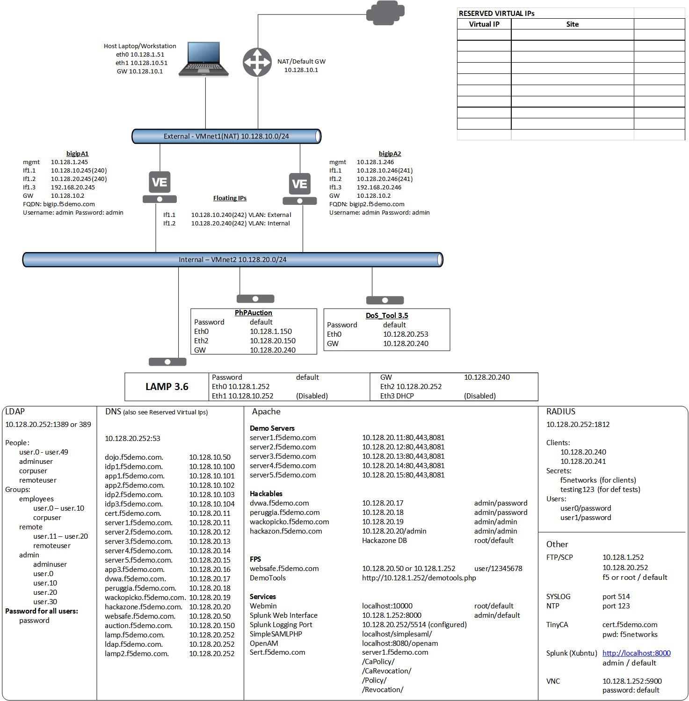
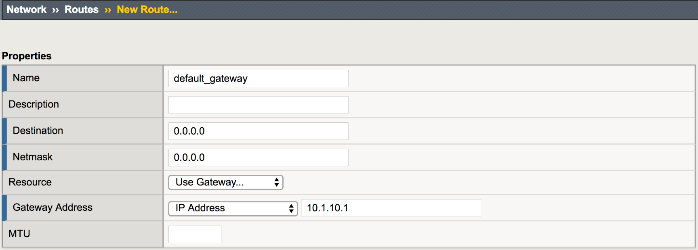
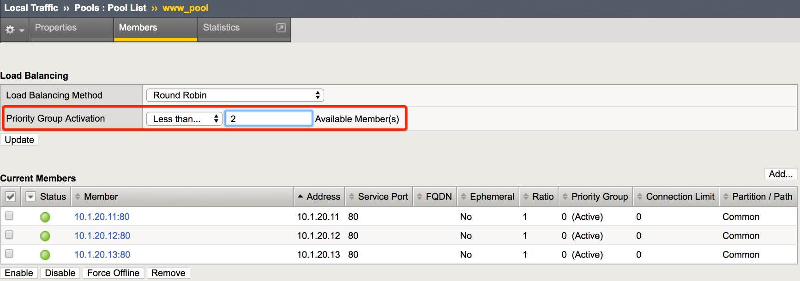
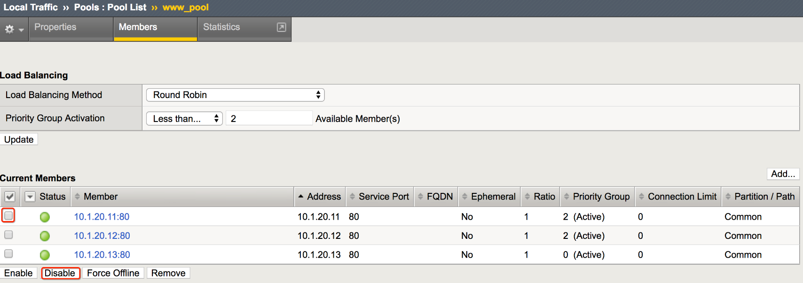
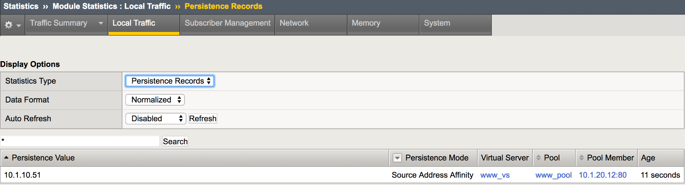
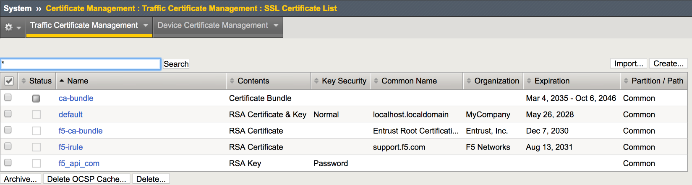
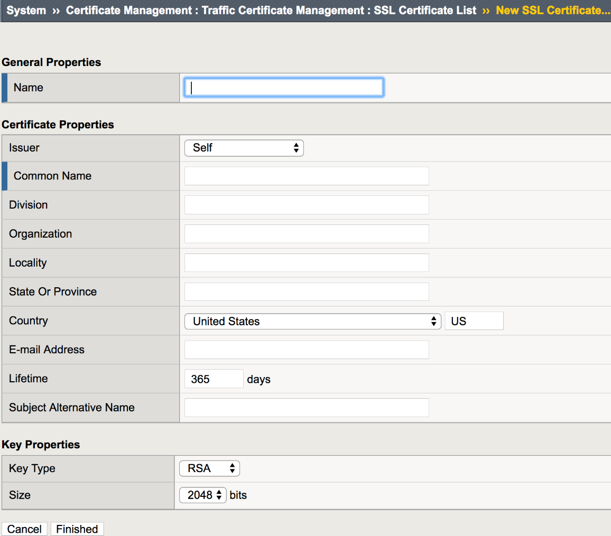
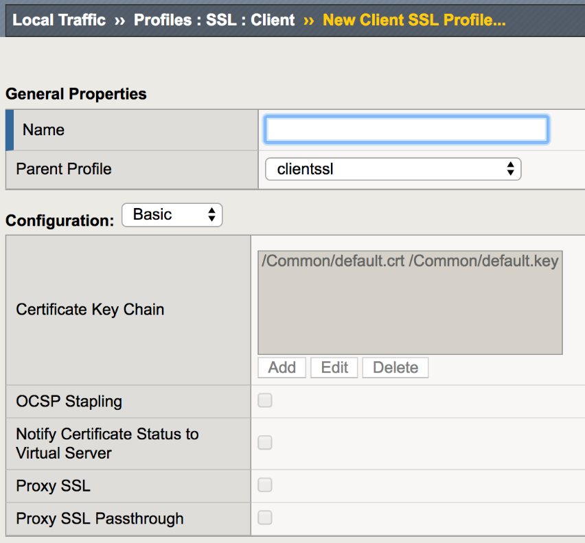
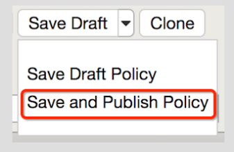

Participant Hands-on Lab Guide

|image0|

    Last Updated: 7/17/2018

©2018 F5 Networks, Inc. All rights reserved. F5, F5 Networks, and the F5
logo are trademarks of F5 Networks, Inc. in the U.S. and in certain
other countries. Other F5 trademarks are identified at f5.com.

Any other products, services, or company names referenced herein may be
trademarks of their respective owners with no endorsement or
affiliation, express or implied, claimed by F5.

Table of Contents
=================

Table of Contents 3

BIG-IP® Local Traffic Manager (LTM) - V13.1 Lab Guide 7

Lab Overview 7

Scenario 8

Lab Network Diagram (based on Lamp3.6) 8

Lab 1: Access the Lab Environment 8

Access the Lab Environment 9

Lab 2: The Basics (Networking, Pools and Virtual Servers) 11

Creating VLANs 11

Assigning a Self IP addresses to your VLANs 13

Assigning the Default Gateway 15

Creating Pools 16

Creating Virtual Servers 17

ExtraCredit! 20

Lab 3: Load Balancing, Monitoring and Persistence 22

Ratio Load Balancing 22

Priority Groups Lab 24

Monitor Labs 26

Content Monitors 27

Monitor Testing 31

Persistence Labs 32

Simple (Source Address) Persistence 32

Cookie Persistence (Cookie Insert) 36

Lab 4: Accelerating Applications Lab 39

TCP Express 39

HTTP Optimization - RamCache Lab 40

HTTP Optimization - HTTP Compression Lab 42

Lab 5: SSL Offload and Security 43

Creating a Self-signed certificate and key 43

Creating SSL Client Profile 45

Building our New Secure Virtual Server 46

Securing Web Applications with the HTTP profile 47

Lab 6: BIG-IP Policies and iRules 49

Using the Builtiin https\_redirect iRule 49

Use a BIG-IP Policy to retrieve images from a different pool 50

Use an iRule to Retrieve Images From a Different Pool 52

Lab 7: Support and Troubleshooting 53

Archive the current configuration and perform a health check using a
QKview 53

Troubleshoot using TCPDump or Curl. 54

Lab 8: Device Service Clusters (DSC) 56

Base Networking and HA VLAN 56

Configure HA 57

Bonus Lab – Traffic groups, iApps and Active-Active 59

Building a new traffic group and floating IP. 59

Building an HTTP application using an iApp template. 59

Active-Active Setup 60

Appendix 61

BIG-IP Policy for retrieving jpeg images from the image\_pool 61

BIG-IP® Local Traffic Manager (LTM) - V13.1 Lab Guide
=====================================================

This lab guide is designed for you to get an understanding of the BIG-IP
Local Traffic Manager (LTM) product.

Lab Overview
------------

-  F5 BIG-IP LTM VE, licensed using F5-BIG-VE-LAB-LIC

-  Your BIG-IP is as close to factory default as possible. Only the
   following changes have been made:

   -  The management IP has already been configured

   -  The initial setup has been completed. (Licensing and Platform
      information)

   -  The Idle Timeout was modified from 1200 seconds to 7200 seconds

   -  The Welcome messages for the GUI and SSH were changed.

   -  An archive file base-setup-and-licensing.ucs was created allowing
      you to revert to the base settings above.

Various directory and application services are available within the lab
environment.

DO NOT COPY INFORMATION FROM THE SCREENSHOTS. THEY ARE FOR REFERENCE
ONLY.

Scenario
--------

Your customer has the following environment. The servers sit on the
customers internal VLANs, the virtual servers will exist in another VLAN
in the DMZ. The customer does not want to rework their networking and
does not wish to use the LTM as the default gateway. Our solution will
be to use SNATs to force traffic to pass through the BIG-IP to return
through the LTM.

Lab Network Diagram (based on Lamp3.6)
======================================

|image1|
Lab 1: Access the Lab Environment
=================================

You will now gain access to your lab environment and your BIG-IP. The
first agenda item is to log in to the training portal. After this, you
will create a remote desktop session to the training environment and
access your BIG-IP.

Access the Lab Environment
~~~~~~~~~~~~~~~~~~~~~~~~~~

1. Using Firefox or Chrome open a connection to the training portal
   supplied by the instructor

   a. Using the IP address supplied by the instructor log on to the
      training portal

      i. 

    |image2|

i.  User: **ltm101student**\ X (where **X** is your student number)

ii. Password: **PieINtheSKYltm101**

a. Open the blueprint or the view link.

    |image3|

a. Find the Xunbutu jumpbox in the list of applications and select
   console to access the jumpbox via the browser. Alternately you can
   use the IP address associated with the jumpbox to access it via RDP.

    |image4|

a. Access the **xbun-jumpbox** using the **Console** (watch for pop-up
   blockers)

   i.  User: **f5student**

   ii. Password: **f5DEMOs4u**

1. To access the BIG-IP open a new browser window and

   a. Click the bookmark **bigip01**

      i.  User: **admin**

      ii. Password: **admin**

   a. Nomenclature for GUI navigation begins on the side-bar and then
      goes to the pop-up or top-bar.

      i. |image5|\ For example: **Go to Local Traffic >> Virtual Servers
         >> Virtual Servers List**

Lab 2: The Basics (Networking, Pools and Virtual Servers)
=========================================================

In this lab we will access the Management GUI. We will then create the
VLANs and assign self IP addresses to our VLAN. As mentioned during our
lecture portion, BIG-IPs may be put in-line or one-armed depending on
your customer’s requirements and topology.

Creating VLANs
~~~~~~~~~~~~~~

    You will need create two untagged VLANs, one client-side VLAN
    (**client\_vlan**) and one server-side VLAN (**server\_vlan)** for
    the devices in your network.

1. From the sidebar select **Network** **>> VLANs** then select
   **Create**

|image6|

a. Under **General Properties**:

   i. **Name**: client\_vlan

b. The name is for management purposes only, you could name them after
   your children or pets

   i. **Tag**: <leave blank>

      1. Entering a tag is only required for “\ **Tagged**\ ” (802.1q)
         interfaces. “\ **Untagged**\ ” interfaces will automatically
         get a tag which is used for internal L2 segmentation of
         traffic.

c. Under **Resources** in the **Interfaces** section:

   i.   **Interface**: 1.1

   ii.  **Tagging**: Untagged

   iii. Select the **Add** button. Leave all other items at the default
        setting.

    |image7|

i. When you have completed your VLAN configuration, hit the **Finished**
   button

Create another untagged VLAN named **server\_vlan** on interface
**1.2.**

Assigning a Self IP addresses to your VLANs
~~~~~~~~~~~~~~~~~~~~~~~~~~~~~~~~~~~~~~~~~~~

1. Go to **Network >> Self IPs**, select **Create**.

|image8|

a. Create a new self IP, for the **server\_vlan** and **client\_vlan**
   VLANs. In **Network >> Self IPs >> New Self IP**, under
   **Configuration** enter:

    **Server-Side Client-side**

i.   **Name**: server\_ip client\_ip

ii.  **IP Address**: 10.1.20.245 10.1.10.245

iii. **Netmask**: 255.255.255.0 255.255.255.0

iv.  **VLAN**: server\_vlan client\_vlan

v.   **Port** **Lockdown**: Allow None Allow None

     1. The default “\ **Allow** **None**\ ” means the Self IP would
        respond only to ICMP.

     2. The “\ **Allow** **Defaults**\ ” selection opens the following
        on the self IP of the VLAN

        a. TCP: ssh, domain, snmp, https

        b. TCP: 4353, 6699 (for F5 protocols, such as HA and iQuery)

        c. UDP: 520, cap, domain, f5-iquery, snmp

        d. PROTOCOL: ospf

     3. **NOTE:** Even with **“Allow None”** chosen, traffic destined
        for a virtual server or object on the F5 (e.g. NAT) are able to
        pas through without issue as any object created on the F5 is by
        default allowed to pass through.

a. When you have completed your self-IP configuration, hit the |image9|
   button. You should have something similar to the following:

|image10|

\ **
**

Assigning the Default Gateway
~~~~~~~~~~~~~~~~~~~~~~~~~~~~~

1. Go to **Network > Routes** and then **Add**.

   a. Here is where we assign our default gateway (and other static
      routes as desired)

|image11|

a. Under **Properties**

   i.   **Name**: default\_gateway

   ii.  **Destination**: 0.0.0.0

   iii. **Netmask**: 0.0.0.0

   iv.  **Resource**: Use Gateway…

   v.   **Gateway** **Address**: 10.1.10.1

   vi.  When you have completed defining your default gateway, hit the
        |image12| button

1. Verify your network configuration

   a. Ping your client-side self IP (**10.1.10.245**) to verify
      connectivity

   b. Use an SSH utility, such as puTTY, to access your BIG-IP
      management port at 10.1.1.245.

      i.   User: **root** Password: **default**

      ii.  Ping your default gateway, 10.1.10.1

      iii. Ping a web server at 10.1.20.11.

Creating Pools
~~~~~~~~~~~~~~

In this lab we will build a pool and virtual server to support our web
site and verify our configurations by accessing our web servers through
the BIG-IP. Verification will be performed visually and through various
statistical interfaces.

1. From the sidebar, select **Local Traffic >>** **Pools** then select
   **Create**. Here we will create our new pool

|image13|

a. Under **Configuration**:

   i.   **Name**: www\_pool

        1. The name is for management purposes only, no spaces can be
           used

   ii.  **Description**: <optional>

   iii. **Health** **Monitor**: http

b. Under **Resources**

   i.   **Load Balancing Method**: <leave at the default Round Robin>

   ii.  **Priority Group Activation**: <leave at default>

   iii. **New Members**:

+---------------+--------------------+
| **Address**   | **Service Port**   |
+===============+====================+
| 10.1.20.11    | 80                 |
+---------------+--------------------+
| 10.1.20.12    | 80                 |
+---------------+--------------------+
| 10.1.20.13    | 80                 |
+---------------+--------------------+

1. As you enter each IP address and port combination, hit the **Add**
   button

a. When you have completed your pool configuration, hit the **Finished**
   button

|image14|

Creating Virtual Servers
~~~~~~~~~~~~~~~~~~~~~~~~

Now let’s build our virtual server

1. Under **Local Traffic** >> **Virtual Servers**, click the **“+”**
   icon

|image15|

a. Under **General Properties**

   i.   **Name:** www\_vs

   ii.  **Description**: <optional>

   iii. **Type:** Standard

   iv.  **Source/Address:** <leave blank>

        1. **Note:** The default is 0.0.0.0/0, all source IP address are
           allowed

   v.   **Destination** **Address/Mask:** 10.1.10.100

        1. NOTE: The default mask is /32

   vi.  **Service Port**: 80 or HTTP

b. Under **Configurations**

   i.  The web servers do not use the BIG-IP LTM as the default gateway.
       This means return traffic will route around the BIG-IP LTM and
       the TCP handshake will fail. To prevent this we can configure
       SNAT Automap on the Virtual Server. This will translate the
       client IP to the self IP of the egress VLAN and ensure the
       response returns to the BIG-IP.

   ii. **Source Address Translation**: Auto Map

    |image16|

a. Under **Resources**

   i.   **iRules**: none

   ii.  **Default Pool**: From the drop down menu, select the pool
        (**www\_pool**) which you created earlier

   iii. **Default Persistence Profile**: None

   iv.  **Fallback Persistence Profile**: None

1. When you have completed your virtual server configuration, hit the
   **Finished** button

2. You have now created a Virtual Server (Note: Items in blue are links)

|image17|

1. Now let’s see if our virtual server works!

   a. Open the browser to the Virtual Server you just created

   b. Refresh the browser screen several times (use “<ctrl>” F5)

|image18|

a. Go to your BIG-IP and view the statistics for the **www\_vs** virtual
   server and the **www\_pool** pool and its associated members

b. Go to **Statistics > Module Statistics > Local Traffic**

   i. Choose **Virtual Servers** from drop down

|image19|

a. Go to **Local** **Traffic >> Virtual Servers>Statistics**

a. Go to **Local** **Traffic >> Pools >> Statistics**

   i.   Did each pool member receive the same number of connections?

   ii.  Did each pool member receive approximately the same number of
        bytes?

   iii. Note the Source and Destination address when you go to directly
        and through the virtual server

1. Let’s archive our configuration in case we have to fall back later.

   a. Go to **System >> Archives** and select **Create**.

      i. Name your archive **lab2\_the\_basics\_net\_pool\_vs**

Extra Credit!
~~~~~~~~~~~~~

You can also review statistics via the CLI! Simply SSH in to the
management IP of your BIG-IP. Refer to your Student Information page and
Network Diagram for the address.

1. Check out the Linux CLI and TMSH

   a. **Username**: root **Password**: default (these are defaults)

      i.   Select VT100 as the terminal type

      ii.  Review the information of the following commands:

      iii. **bigtop –n**

           1. Type **q** to quit.

   a. Take a look at the TMOS CLI, type “\ **tmsh**\ ” to enter the
      Traffic Management Shell.

      i.   (tmos)# **show ltm pool**

      ii.  (tmos)# **show ltm pool detail**

           1. show statistics from all pools

      iii. (tmos)# **show ltm virtual**

      iv.  (tmos)# **show ltm virtual detail**

           1. Show statistics of all virtual servers

1. Build an FQDN pool.

   a. Go **to System ›› Configuration : Device : DNS**

      i.  In the **DNS Lookup Server List,** in the **Address** box
          enter **10.1.20.252**, hit the **Add** button.

          1. This is the lab DNS server. Don’t forget to **Update.**

      ii. From the Linux CLI do a **dig fqdnpool.f5demo.com**. You will
          see IP addresses for that name.

   b. Go to **Local Traffic ›› Pools : Pool List** and select **Create**

      i.  Name the pool **fqdn\_pool** and give the pool an **http**
          monitor.

      ii. In **New Members**, select the **New FQDN Node** button.

          1. The **FQDN** is **fqdnpool.f5demo.com** and the **Server
             Port** is **8081**. Hit **Add** and **Finished**.

   c. You will see the BIG-IP queried the DNS server and built a pool
      based on the answered. Modifying the FQDN on the name server will
      cause the pool to be modified.

2. Check out the Dashboard!

   a. Go to **Statistics>Dashboard**

|image20|

1. Click the Big Red F5 ball. This will take you to the Welcome page.
   Here you can find links to:

   a. User Documentation, Running the Setup Utility, Support, Plug-ins,
      SNMP MIBs

Lab 3: Load Balancing, Monitoring and Persistence
=================================================

Objectives:

-  Configure and review Ratio load balancing

-  Build and test priority groups

-  Build a content monitor that looks for a receive string and requires
   authentication

-  Build and review simple (source IP) persistence and cookie
   persistence.

Ratio Load Balancing
~~~~~~~~~~~~~~~~~~~~

1. Go to Local **Traffic >> Pools** and select **www\_pool** and then
   **Members** from the top bar or you could click on the **Members**
   link in the Pool List screen.

|image21|

a. Note: When we created the pool, we performed all of our
   configurations on one page, but when we modify a pool the
   **Resource** information is under the **Members** tab

1. Under **Load** **Balancing** section

   a. Change the **Load** **Balancing** **Method** to **Ratio (Member)**

   b. As you look at the drop-down menu, notice most load balancing
      methods have two options: (Node) or (Member). Remember the
      difference?

|image22|

a. Don’t forget the **Update** button

b. Then under **Current Members**

   i.  Select the first member in the pool **10.1.20.11:80**.

   ii. Under the **Configuration** section

       1. Change the **Ratio** of the member to 3

|image23|

a. Select the **Update** button

1. Verification

   a. Check the pool statistics by selecting **Statistics** on the top
      bar, if you are still in **Local Traffic >> Pools**, or by going
      to **Statistics >> Module Statistics >> Local Traffic** and
      selecting **Pool** from **Statistics Type**.

   b. Reset the statistics for your **www\_pool** pool by checking the
      boxes next to the pool members and hitting the **Reset** button

      i.   Browse to your **www\_vs** **(10.1.10.100)** virtual server

      ii.  Refresh the browser screen several times (use “<ctrl>” F5)

      iii. Select the **Refresh** button on the **Statistics** screen

      iv.  How many total connections has each member taken?

      v.   Is the ratio of connections correct between the members?

   c. Now go back and put the pool load balancing method back to Round
      Robin

      i.   Reset the statistics

      ii.  Refresh the virtual server page several times

      iii. Refresh the statistics

      iv.  Does the ratio setting have any impact now?

Priority Groups Lab
~~~~~~~~~~~~~~~~~~~

Let’s look at priority groups. In this scenario we will treat the
**.13** server as if it were in a disaster recovery site that can be
reached over a backhaul. The customer would like to maintain at least
two members in the pool for redundancy and load. They would find this
beneficial to allow connections to proceed during a maintenance window
or during an outage.

1. Go to **Local Traffic >> Pools >> www\_pool**

   a. Select the **Members** tab.

      i.  Set the **Load Balancing Method** back to **Round Robin**

      ii. Set the **Priority Group Activation** to **Less than …** **2**
          Available Members.

|image24|

a. Don’t forget to hit the **Update** button

b. Select the pool members **10.128.20.11** and **10.128.20.12** and set
   their **Priority Group** to **2**.

   i. This will allow you to change the priority on that particular
      member.

|image25|

1. Review your settings and let’s see how load balancing reacts now

   a. Select the **Statistics** tab.

   b. Reset the pool statistics.

   c. Browse to your virtual server and refresh several times.

   d. Refresh your statistics.

   e. Are all members taking connections?

   f. Which member isn’t taking connections?

2. Let’s simulate a maintenance window or an outage by disabling a pool
   member in the highest priority group (2).

   **NOTE:** F5 ranks priority from low number to high number. This
   means, a priority of 1 has a lower priority than 2, and onwards.

   This should cause priority group activation to kick in, since the
   number of active members in our high priority group has dropped below
   one.

3. Select the member in the Priority Group 2 and Disable that pool
   member.

   a. Select the **Disable** button

|image26|

a. The status indicator now goes to black, indicating the member has
   been disabled

1. Once again, select **Statistics**, reset the pool statistics, browse
   to the virtual server and see which pool members are taking hits now.

Once you are done testing re-enable your disabled pool member.

Monitor Labs
~~~~~~~~~~~~

Objective:

-  Build a default monitor for nodes

-  Build a content monitor for your pool

Default Monitors

1. Go to **Local Traffic >> Nodes**, note the status of the nodes.

   a. Note that the nodes exist in this table, even though they were
      never specifically configured in the Node section of the GUI. Each
      time a unique IP address is placed in a pool a corresponding node
      entry is added and assigned the default monitor (if any).

   b. Select the **Default Monitors** tab.

|image27|

a. Notice we have several options. For nodes you will want a generic
   monitor, so we will choose **icmp**.

b. Select **icmp** from the **Available** box and hit |image28| to place
   it in the **Active** box.

c. Click on the **Update** button to finalize your changes.

1. Select **Node List** or **Statistics** from the top tab.

   a. What are your node statuses?

2. Select **Statistics >> Module Statistics >> Local Traffic**

   a. What are the statuses of your nodes, pool and virtual server?

For those of you who did the **FQDN Pool** extra credit lab, you will
notice your FQDN in the node list. The status should be **Available**
(Green) even though there wasn’t a monitor. This is because a good
status indicates the BIG-IP successfully queried the DNS server for the
name. Click on the FQDN node to see additional options, such as query
interval.

Content Monitors
~~~~~~~~~~~~~~~~

The default monitor simply tells us the IP address is accessible, but we
really don’t know the status of the particular application the node
supports. We are now going to create a monitor to specifically test the
application we are interested in. We are going to check our web site and
its basic authentication capabilities.

1. Browse to **http://10.1.10.100** and on the web page select the
   **Basic Authentication** link under **Authentication Examples**.

   a. User: **user.1**

   b. Password: **password**

   c. You could use text from this page or text within the source code
      to test for availability. You could also use HTTP statuses or
      header information. You will be looking for the HTTP status
      “\ **200 OK**\ ” as your receive string to determine availability.

   d. Note the URI is **/basic**. You will need this for your monitor.

2. Select **Local Traffic >> Monitor** on the side-bar and select the
   plus (**+**) sign or **Create**

|image29|

a. Now we can create a monitor to check the content of our web page to
   ensure things are running properly.

   i.  **Name**: www\_test

   ii. **Type**: HTTP

|image30|

a. Once you have selected you parent **(Type)** monitor, you can access
   the **Configuration** section

   i.   **Send String**: Enter the command to retrieve the page you want
        “\ **GET /basic/\\r\\n**\ ” (no quotes)

   ii.  In the Receive String box put “\ **200 OK**\ ” (no quotes)

        1. **NOTE**: The receive string is not case sensitive.

   iii. Enter **user.1**/**password** for the **Username** and
        **Password**

|image31|

a. Click **Finish** and you will be taken back to **Local Traffic >>
   Monitors**

1. Where is your new Monitor?

   a. |image32|\ **Hint:** Check the lower right hand corner of the
      Monitors list. Here you can go to the next page or view all
      Monitors

   b. You can change the number of records displayed per page in
      S\ **ystem >> Preferences**

2. Go to **Local Traffic >> Pools >> www\_pool** and choose
   **Properties** from the top bar

   a. Remove the **http** monitor from the Active box.

   b. Select the **www\_test** monitor from the Available monitor’s
      window in the **Configuration** section and move it to the Active
      window.

|image33|

1. Once you have selected your parent (Type) monitor, you can access the
   **Configuration** section

   a. Select **Statistics** from the tabs.

   b. What is the status of the pool and its members?

2. Go to **Local Traffic >> Virtual Servers**. What is the status of
   your virtual server?

   a. Browse to your **www\_vs** virtual server. Which members are
      taking traffic?

   b. Just for fun reverse the monitor. Now when **200 OK** is returned
      it indicates the server is not responding successfully. You can
      see where this would be useful if you were looking for a 404 (bad
      page) response.

Monitor Testing
~~~~~~~~~~~~~~~

There is now the ability to test monitors. This is tremendously helpful
as you no longer need to create monitors and add them to false objects
on the BIG-IP. The functionality is now built in to the monitor itself
to be less invasive on your infrastructure, and less time consuming all
together.

1. Go to **Local Traffic >> Pools >> www\_pool**

   a. Under **Configuration**, move the active monitor to **Available**

2. Go to **Monitors** and click on **http**

   a. Click the **Test** tab

   b. Under **Address** plug in **10.1.20.11** and in the port field
      plug in **80**

   c. Click **Test**

|image34|

a. Go back to **Local Traffic >> Pools >> www\_pool**

   i. Once here, move **http** back to **Active**

Persistence Labs
~~~~~~~~~~~~~~~~

In this lab we will configure a couple types of persistence and view
their behavior. For persistence, profiles will have to be created and
attached to our virtual server.

Lab Requirements:

-  Prior to beginning the lab verify your **www\_pool** has been set to
   the following parameters:

   -  **Load Balancing Method**: Round Robin

   -  **Priority Group Activation**: Disable

      -  The members **Ratio** and **Priority** **Group** mean nothing
         since we aren’t using Ratio load balancing and Priority Groups
         are disabled.

   -  Hit **Update**

   -  Hit your virtual server several times, you should see all 3
      servers respond.

Simple (Source Address) Persistence
~~~~~~~~~~~~~~~~~~~~~~~~~~~~~~~~~~~

1. Go to **Local** **Traffic >> Profiles** and select the
   **Persistence** tab.

   a. From the **Persistence Profiles** screen select the **Create**
      button.

|image35|

a. At the **New Persistence Profile** screen enter:

   i.  **Name**: my-src-persist

   ii. **Persistence** **Type**: Source Address Affinity

|image36|

a. This will add the **Configuration** section to the **General**
   **Properties** section.

   i. Note the parent profile.

b. In the **Configuration** section, set the

   i.   **Timeout**: 60 seconds

   ii.  **Prefix Length**: None

        1. This is the default and is a /32 prefix (255.255.255.255
           mask).

        2. Each new IP address will create a new persistence record.

   iii. **Hint**: You can’t change these settings until you have checked
        the Custom box. This prevents unwanted or unauthorized changes
        from within the GUI, without explicitly allowing it. Also, it
        allows you to know what has changed from the default settings.

c. You have just created your first custom Profile.

   i. Note the check box for your new custom profile isn’t grayed out
      and can be selected to allow you to delete the profile if desired.

1. Now let’s attach our new profile to the virtual server.

   a. Go to **Local Traffic >> Virtual Server** and ….

      i.  Select **www\_vs** and the **Resources** tab or ….

      ii. Take the shortcut directly to the **Resources** of the virtual
          server. (Can you find it?)

**Note:** When we created the Virtual Server, everything was on a single
page. We find when we return to modify the Virtual Server the Properties
and Resources are on different pages.

a. Set the **Default Persistence Profile** to **my-src-persist**.

|image37|

a. Don’t forget to **Update** before leaving the page. *(Be careful, the
   reminders will stop!)*

b. Testing Source Address Affinity

   i.   At this point you may want to open a second browser window to
        the management GUI.

   ii.  From one management window go to **Statistics >> Module
        Statistic >> Local Traffic**

   iii. Select **Persistence Records** for the **Statistics Type** menu

|image38|

1. At this point you will see that the Persistence Records statistics
   display has been disabled (way back in v12.1). A TMSH database
   command is required to activate it.

   a. SSH to you BIG-IP at 10.1.1.245. Username: **root** Password:
      **default**

   b. At the prompt enter: **tmsh**

   c. At the TMSH prompt enter the command in the **Persistence Value**
      GUI.

      i. **modify sys db
         ui.statistics.modulestatistics.localtraffic.persistencerecords
         value true**

         1. Tab completion will make this a little easier

2. Now, in this window you can watch your persistence records. You may
   want to set **Auto Refresh** to 20 seconds.

|image39|

1. In your other management GUI window go to **www\_pool** and clear the
   member statistics.

   a. Open a browser session to your virtual server and refresh several
      times.

   b. How many members are taking traffic?

   c. Check you **Persists Records** window. Are there any persistence
      records?

      i. If you are not Auto Refreshing, don’t forget to hit **Refresh**

   d. Refresh you web page prior to the **Age column** reaching **60.**
      What happens?

Cookie Persistence (Cookie Insert)
~~~~~~~~~~~~~~~~~~~~~~~~~~~~~~~~~~

1. Go to **Local Traffic >> Profiles >> Persistence** tab and hit
   **Create**

a. Let’s name our profile **my\_cookie\_insert** (original isn’t it)

b. Our **Persistence Type** will be **Cookie**

c. This brings us to the **Configuration** section.

|image40|

1. As you can see, the default **Cookie Method** is **HTTP** **Cookie**
   **Insert**, so we won’t have to modify the **Cookie Method**

a. The BIG-IP will also create a cookie name for you using a combination
   of “\ **BIGipServer**\ ” and the pool name the virtual server
   service. We will take this default also.

b. We will use a **session** cookie. Which means the cookie is deleted
   when the browser is closed.

c. Select **Finished**

d. Now attach your cookie persistence profile to your virtual server’s
   **Default Persistence Profile** by:

   a. Go to **Local Traffic >> Virtual Server >> www\_vs >> Resources**
      tab

   b. Set the **Default Persistence Profile** to **my\_cookie\_insert**

   c. Hit **Update**

e. Whoa! Did you just get this error message?

|image41|

a. Remember what we said earlier about some Profiles requiring
   prerequisite Profiles? Since we are looking in the HTTP header for
   the cookie the prerequisite for the Cookie Profile is the HTTP
   profile.

1. We will have to go to the virtual server to add the HTTP profile,
   prior to adding the Cookie Persistence profile.

   a. Select the **Properties** tab on your virtual server

   b. Go to **HTTP Profile** in the **Configuration** section and select
      the default HTTP (**http**) profile.

|image42|

a. Hit the **Update** button

b. Now we can go back to the **Resource** tab and add our cookie
   persistence profile.

1. Testing cookie persistence.

   a. If you wish you can watch the member statistics to validate your
      persistence.

   b. Open a new browser session to your virtual server and refresh
      several times.

   c. Does the page ever change?

   d. Did you hit a different server?

   e. Refresh several times. Are you hitting the same server?

      i. On the web page under **HTTP Request and Response Information**
         click the **Display Cookie** link.

|image43|

Archive your work in the file: **lab3\_lb\_monitor\_and\_persist**

Lab 4: Accelerating Applications Lab
====================================

Objectives:

-  Assign client-side and server-side profiles

-  Set up caching for your web site

-  Set up compression for your web site

Lab Prerequisites:

-  Prior to starting this lab remove the cookie persistence profile from
   your virtual server.

TCP Express
~~~~~~~~~~~

1. Set client-side and server-side TCP profiles on your virtual server
   properties.

   a. In some earlier version you would be required to select the
      **Advanced** menu to see the Client and Server protocol profiles.

|image44|

a. If you chose to use the **Advanced** menu you would see a whole array
   of new options. There are **Basic** and **Advanced** drop downs on
   many of the GUI menus. You can always see **Advanced** menus by
   changing the preferences in **System >> Preferences.**

b. From the drop-down menus place the **tcp-wan-optimized** profile on
   the client-side and the **tcp-lan-optimized** profile on the
   server-side.

    |image45|

HTTP Optimization - RamCache Lab
~~~~~~~~~~~~~~~~~~~~~~~~~~~~~~~~

1. Visit your virtual server’s web page and refresh it several times.
   Note the Source Node for the pictures of the BIG-IPs. They change
   depending on where the connection is coming from. The Source Node
   information is part of the picture.

2. Go to **Local Traffic >> Profiles >> Services >> Web Acceleration**
   or **Acceleration >> Profiles >> Web Acceleration**

a. Create a new profile named **www-opt-caching** using
   **optimized-caching** as the Parent Profile.

b. Take all the defaults, no other changes are required.

1. Open up your **www\_vs** virtual server.

a. At the **HTTP Profile** drop down menu make sure **http** is
   selected.

b. Under **Acceleration** at **Web Acceleration** **Profile** select
   your new caching profile; **www-opt-caching**

c. Clear the statistics on your pool and the refresh the main web page
   several times.

   i.  The pictures do not change. Why do you think that is?

   ii. Go to your pool. Are all pool members taking connections?

1. Now go to **Statistics >> Module Statistics >> Local Traffic** on the
   sidebar. From the **Statistics Type** drop-down menu select
   **Profiles Summary**

|image46|

1. Select the View link next to the **Web Acceleration** profile type

|image47|

|image48|

1. You can get more detailed information on RamCache entries at the CLI
   level

a. Log onto the CLI of your BIG-IP via SSH using the root account (user:
   **root** password: **default**).

b. At the CLI go into **tmsh** at the **(tmos)#** prompt

c. At the shell prompt enter **show ltm profile ramcache
   www-opt-caching**

HTTP Optimization - HTTP Compression Lab
~~~~~~~~~~~~~~~~~~~~~~~~~~~~~~~~~~~~~~~~

1. Go to **Local Traffic >> Profiles >> Service>HTTP Compression** or
   **Acceleration >> Profiles >> Web Acceleration**

   a. Create a new profile, **www-compress**, using the
      **wan-optimized-compression** default profile.

2. Open up your **www\_vs** virtual server.

a. At the **HTTP Profile** drop down menu make sure **http** is selected

b. At the **Web Acceleration** drop-down menu select **None**

   i. *For the purpose of this lab we don’t want caching interfering
      with our response headers*

c. At the **HTTP Compression** drop-down menu select the HTTP
   compression profile you just created

1. Now open your virtual server’s web page and under **Content Examples
   on This Host** select the **HTTP Compress Example** and **Plaintext
   Compress Example** link

   a. Now off to the statistics on the sidebar. Under the **Local
      Traffic** drop-down menu select **Profiles Summary**

   b. Select the **View** link next to the **HTTP Compression** profile
      type

|image49|

a. On the web page under **HTTP** **Request and Response Information**
   select the **Request and Response Headers** link.

   i. Notice you no longer see the **Accept-Encoding** header in the
      **Request Headers Received at the Server** section

Archive your work in a file called: **lb4\_acceleration**

Lab 5: SSL Offload and Security
===============================

In this Lab we will configure client-side SSL processing on the BIG-IP

Objective:

-  Create a self-signed certificate

-  Create a client SSL profile

-  Modify your HTTP virtual server to use HTTPS

-  Add additional security to your HTTPS web server using the HTTP
   profile

We will create a self-signed certificate and key for a client SSL
profile to attach to our virtual server

Creating a Self-signed certificate and key
~~~~~~~~~~~~~~~~~~~~~~~~~~~~~~~~~~~~~~~~~~

1. Go to **System >> Certificate Management >> Traffic Certificate
   Management >> SSL Certificate List** and select **Create**

|image50|

a. **NOTE:** The default key size is **2048**. You can save SSL
   resources on the **server-side** by lowering this key size

|image51|

a. Enter:

   i.   **Name**: my-selfsigned-cert

   ii.  **Issuer**: Self

   iii. **Common Name**: www.f5demo.com

   iv.  Fill out the rest any way you would like

Creating SSL Client Profile
~~~~~~~~~~~~~~~~~~~~~~~~~~~

1. Go to **Local** **Traffic >> Profiles >> SSL >> Client** menu and
   select **Create**

|image52|

a. Under **General Properties**

   i. **Name**: my\_clientssl\_profile

b. Under **Configuration** in the **Certificate Key Chain** section,
   select the **Custom** box and hit **Add**

   i.  In the **Add SSL Certificate to Key Chain** pop-up select:

       1. **Certificate**:         my-selfsigned-cert

       2. **Key**:                     my-selfsigned-cert

   ii. Select **Add**

|image53|

a. Hit **Finished.**

Building our New Secure Virtual Server
~~~~~~~~~~~~~~~~~~~~~~~~~~~~~~~~~~~~~~

1. Go to **Local Traffic >> Virtual Servers** and hit the **Create**
   button or hit the **“+”** next to Virtual Servers

   a. **Name**: secure\_vs

   b. **Destination Address/Mask**: 10.1.10.105

   c. **Port**: 443 or HTTPS

   d. **SSL Profile (Client)**: my\_clientssl\_profile (the profile you
      just created)

   e. **Source Address Translation**: Auto Map (remember why we need
      this?)

   f. **Default Pool**: www\_pool

   g. Default all other settings. (Notice you did not require an HTTP
      profile)

   h. **Finish**

1. Test our secure server. Go to you **secure\_vs** at
   **https://10.1.10.105**

   a. If you want to watch member traffic, go to the **www\_pool** and
      reset the statistics

   b. Browse to your secure virtual server

   c. What port did your pool members see traffic on?

Securing Web Applications with the HTTP profile
~~~~~~~~~~~~~~~~~~~~~~~~~~~~~~~~~~~~~~~~~~~~~~~

1. Let’s begin by creating a custom HTTP profile

   a. Go to **Local Traffic >> Profiles >> Services**, select **HTTP**
      and create a new profile

   b. Under **General Properties**

      i. **Name**: secure-my-website

   c. Under **Settings**:

      i.   Set the **Fallback Host**: http://10.1.1.252 *(this will take
           you an internal site) *

      ii.  **Fallback on Error Codes**: 404 (fallback site if a 404
           error is received)

      iii. **Response Headers Allowed**: Content-Type Set-Cookie
           Location

      iv.  **Insert XForwarded For**: Enabled (because we talked about
           it earlier)

|image54|

a. Attach your new HTTP Profile to your secure (HTTPS) virtual server

1. Browse to your secure virtual server.

   a. Do web pages appear normal?

   b. Now browse to a bad page

      i. For example,

         1. What is the result?

   c. Go to the **Request and Response Headers** page. You should see a
      sanitized server response at the bottom of the web page and the
      original client IP address

   a. You can compare the headers by accessing your HTTP virtual server
      at http://10.1.10.100

   b. While you are looking at the headers, check for the
      **X-Forwarded-For** header received by the server

      NOTE: Even though the data is encrypted between your browser and
      the virtual server, the LTM can still modify the data (i.e.
      resource cloaking) because the data is unencrypted and
      decompressed within TMOS

Archive your work in a file called: **lab5\_security**

Lab 6: BIG-IP Policies and iRules
=================================

When clients attempt to access your **secure\_vs**, you don’t want them
to have to remember to type HTTPS before the web site, but you also
don’t want to open port 80 (HTTP) on your web servers as that is just
asking for trouble. To avoid this issue, you will be creating an HTTP
virtual server that will redirect HTTP to HTTPS and the **secure\_vs**.
Also, you will write an iRule and a BIG-IP policy that will retrieve
images from a different pool of servers than the default pool attached
to the virtual server. This will give you a simple comparison between
the two methods. You will use a policy on the HTTP server and an iRule
on the HTTPS virtual server.

Using the Builtiin https\_redirect iRule
~~~~~~~~~~~~~~~~~~~~~~~~~~~~~~~~~~~~~~~~

1. While it would be easy to write your own redirect iRule, note that F5
   has one prebuilt that you can use

   a. Example of simple redirect iRule:

    ***when HTTP\_REQUEST {***

    ***HTTP::redirect https://[HTTP::host][HTTP::uri]***

    ***}***

1. Go to **Local Traffic >> iRules**

   a. In the search box at the top of the list of iRules, type
      **redirect** and hit **Search.**

|image55|

a. Open the iRule and take a quick look. This is an F5 Verified and
   supported iRule.

1. Create your HTTP-to-HTTPS redirect virtual server.

   a. Go to **Local Traffic >> Virtual Servers** and create a new
      virtual server.

      i.   **Name:** redirect\_to\_secure\_vs

      ii.  **Destination:** <same IP as secure\_vs>

      iii. **Service Port:** 80 (HTTP)

      iv.  **Source Address Translation:** None <you don’t need this as
           this traffic is going nowhere>

      v.   **iRule:** **\_**\ sys\_https\_redirect

      vi.  Hit **Finished**

           1. **WOW!** That didn’t go too far did it. You just got an
              error. If you are going to redirect the HTTP request, you
              need the HOST and URI information and that requires the
              HTTP protocol

   b. In the **Configuration** section make sure the default **http**
      profile is added to the virtual server

   c. HTTP Profile: **http**

   d. Select **Finished**

1. Test your policy by going to **http://<ip address of your virtual>**

   a. You should be redirected to the HTTPS virtual server

   b. As you can see, very small iRules can make a very big difference

Use a BIG-IP Policy to retrieve images from a different pool 
~~~~~~~~~~~~~~~~~~~~~~~~~~~~~~~~~~~~~~~~~~~~~~~~~~~~~~~~~~~~~

1. **Create** a new pool named **image\_pool**, use the **http** monitor
   for status, and add one member **10.1.20.14:80**

1. First you will create your policy container and set your match
   strategy

   a. Try to do this using the instructions, but a screen shot of the
      policy is available in the **Appendix** at the end of the lab
      guide if you would like it

2. Go to **Local Traffic >> Policies : Policy List** and select
   **Create**

   a. **Policy\_Name:** access\_image\_pool

   b. **Strategy:** Execute **first** matching rule

   c. **Create Policy**

    |image56|

1. Now you can create/view policy rules by selecting **Create**

   a. **Name:** get\_jpegs

   b. In the box under **Match all of the following conditions:** select
      the |image57| to the right of **All Traffic**

      i.  Use the drop-down menus to look at the **HTTP URI** and check
          if it **ends\_with** an image type

      ii. Look for JPEGs by adding **jpg** in the box under the **any
          of** box and selecting **Add**

|image58|

a. Under **Do the following when the traffic is** matched, build the
   following operation.

   i. **Forward Traffic** to the **pool** named **image\_pool**

b. **Save**

    |image59|

1. The policy is saved in **Draft** form and is not available until
   **Published**. To publish the policy:

   a. Select the **Save Draft Policy** drop-down menu and select **Save
      and Publish Policy**

|image60|

1. Go to the **Resources** section of your **www\_vs** virtual server
   and select **Managed** over the **Policies** box

   a. Move **access\_image\_pool** for the **Available** box to the
      **Enabled** box

\ |image61|

1. Now test your change by browsing to
   `**http://10.1.10.100** <http://10.1.10.100>`__

   a. If your policy is working correctly, all of the images under **F5
      Platform List** should be from **NODE #4**

   b. Other images are PNG images and have a different extension

|image62|

Use an iRule to Retrieve Images From a Different Pool 
~~~~~~~~~~~~~~~~~~~~~~~~~~~~~~~~~~~~~~~~~~~~~~~~~~~~~~

1. Now you will use an iRule to perform the same image retrieval. Your
   **image\_pool** is already created

2. Go to **Local Traffic >> iRules** and select **Create**

   a. **Name:** access\_image\_pool

   b. In the **Definition** section enter the following:

    |image63|

a. This activity is not meant to be “cut and paste”. We want you to get
   comfortable and familiar with typing iRules inside the GUI.

   i. Try hovering the cursor over a command or event, such as,
      **HTTP\_REQUEST** or **HTTP:uri**. You will see a definition of
      the item. For example:

    |image64|

1. Save your iRule and go to the **Resources** section of your
   **secure\_vs** and select **iRules >>** Manage

   a. Move your **access\_image\_pool** iRule into the **Enabled** box

2. Test your **secure\_vs** virtual by going to **https://10.1.10.105**

   a. The results should be the same as before

3. **Extra Credit!** Change both the policy and iRule to access the
   **image\_pool** for **png** file types

   a. You should notice one is easier to update than the other

Lab 7: Support and Troubleshooting
==================================

In this lab, you will review your BIG-IP using iHealth and perform some
basic troubleshooting commands

Objective:

-  Collect a QKView and upload it to http://ihealth.f5.com and review
   the results

-  Perform a TCPDump to watch traffic flow

-  Obtain web page information via Curl

Archive the current configuration and perform a health check using a QKview
~~~~~~~~~~~~~~~~~~~~~~~~~~~~~~~~~~~~~~~~~~~~~~~~~~~~~~~~~~~~~~~~~~~~~~~~~~~

1. Obtain a **QKView**. Go to **System >> Support **

   a. Click **New Support Snapshot**

      **NOTE: If you have an iHealth account, you can choose to use the
      Generate and Upload QKview to iHealth option as long as your
      management port has Internet access. For this exercise, we will
      skip this.**

   b. From the drop-down, select **Generate QKview**

   a. Select **Download** and download the QKView to your PC

   b. **NOTE:** If you leave the **Support** page and return you will
      still the **Support Snapshot** screen. You CANNOT create another
      **QKView** or **TCP Dump** until the QKView is deleted.

1. Import the QKView into iHealth.

   a. Go to `**http://ihealth.f5.com** <http://ihealth.f5.com>`__. **If
      you don’t have an account, now is the time to create one and then
      skip to the next section “Troubleshoot using TCPDump or Curl”
      because it will take time for your account set up.**

   b. Select the **Upload** button and upload the QKView file you
      download from your BIG-IP

   c. Once the file is uploaded, you can click on the hostname to view
      you the heuristics

      i.  Note the Diagnostics. Go to **Diagnostics >> Critical** on the
          side-bar.

          1. Example: **The configuration contains user accounts with
             insecure passwords** is because we are using default
             passwords

      ii. Select **Network >> Virtual Servers**, then click on the small
          white triangles to expand the view or go to **Pools**, then
          **Pool Members** to continue to expand the view.

          1. This is a little more detailed than **Local Traffic >>
             Network Map**

   d. If you want to see some interesting CLI commands, go to **Commands
      >> Standard** and expand **tmsh** then **LTM** and click on **show
      /ltm virtual** toward the bottom

   e. Under **Files >> config** you can view the **bigip.conf** file and
      see the command lines you used for you build

      i. All of the **log** files are here too

   f. Feel free to just poke around

Troubleshoot using TCPDump or Curl.
~~~~~~~~~~~~~~~~~~~~~~~~~~~~~~~~~~~

1. Go to your **www\_vs (10.1.10.100)** virtual server and set **Source
   Address Translation** to **None**.

   a. Now browse the web site. You will not be able to access it even
      though the status of the virtual is available.

      i. Because the BIG-IP is not the server’s default gateway of the
         servers their response goes around the BIG-IP.

   a. The web administrator tells you everything is fine as far as he
      can see and thinks the issue is with the BIG-IP, because they
      ALWAYS think the issue is with the BIG-IP

   b. You begin by debugging the client connections to the web servers
      through the BIG-IP using TCPDump

1. SSH to the management port of your BIG-IP.

   **Remember the BIG-IP is a full proxy. You will need two dumps and
   therefore two SSH windows for the client-side connection and the
   server-side connection.**

   a. First let’s see if we are hitting the virtual server. At the Linux
      CLI prompt:

      i. **tcpdump –i <client vlan name> host –X –s128 10.1.10.100 and
         port 80**

         1. This is a little overkill, but a good example of syntax. We
            will only look at traffic headed for the virtual server. We
            will see the first 128 bytes (-s128) in ASCII (-X).

   b. Go to your browser and attempt to access the virtual server. You
      should see something like this:

    17:38:40.051122 IP **10.1.10.1**.43932 > 10.1.10.245.http: S
    522853636:522853636(0) win 8192 <mss 1460,nop,wscale
    2,nop,nop,sackOK>

    0x0000: 0ffe 0800 4500 0034 0a40 4000 4006 0699 ....E..4.@@.@...

    0x0010: 0a80 0a01 0a80 0aeb ab9c 0050 1f2a 1d04 ...........P.\*..

    0x0020: 0000 0000 8002 2000 3d10 0000 0204 05b4 ........=.......

    0x0030: 0103 0302 0101 0402 ........

    17:38:40.051169 IP 10.1.10.245.http > 10.1.10.1.43932: S
    245310500:245310500(0) ack 522853637 win 4380 <mss 1460,sackOK,eol>

    0x0000: 0ffe 0800 4500 0030 27ef 4000 ff06 29ed ....E..0'.@...).

    0x0010: 0a80 0aeb 0a80 0a01 0050 ab9c 0e9f 2424 .........P....$$

    0x0020: 1f2a 1d05 7012 111c 2a0e 0000 0204 05b4 .\*..p...\*.......

    0x0030: 0402 0000 ....

    17:38:40.053644 IP 10.1.10.1.43932 > 10.1.10.244.http: . ack 1 win
    64240

    0x0000: 0ffe 0800 4500 0028 0a41 4000 4006 06a4 ....E..(.A@.@...

    0x0010: 0a80 0a01 0a80 0aeb ab9c 0050 1f2a 1d05 ...........P.\*..

    0x0020: 0e9f 2425 5010 faf0 7018 0000 ..$%P...p...

    17:38:40.053648 IP 10.1.10.1.43932 > 10.1.10.245.http: P 1:416(415)
    ack 1 win 64240

    0x0000: 0ffe 0800 4500 01c7 0a42 4000 4006 0504 ....E....B@.@...

    0x0010: 0a80 0a01 0a80 0aeb ab9c 0050 1f2a 1d05 ...........P.\*..

    0x0020: 0e9f 2425 5018 faf0 43c5 0000 4745 5420
    ..$%P...C...\ **GET**.

    0x0030: 2f20 4854 5450 2f31 2e31 0d0a 486f 7374 **/.HTTP/1.1..Host**

    0x0040: 3a20 3130 2e31 3238 2e31 302e 3233 350d **:.10.1.10.245**.

a. Well you are hitting the virtual server so let’s look a little deeper
   and expand our dump. Your original client IP is in the first line of
   the dump 16:44:58.801250 IP **10.1.10.1**.41536 > 10.128.10.245.https

1. In the second SSH window we will do an expanded **tcpdump** for the
   sake of interest

   a. **tcpdump –i <server vlan name> -X –s128 host <client IP>**

   b. Hit your virtual server again. As you can see, we are sending
      packers to the pool members. They just aren’t responding so we can
      reasonably suspect it’s a server issue.

2. It could be a port issue. Let’s check to see if the server is
   responding on port 80. On the BIG-IP, in an SSH window:

   a. Do a **<ctrl-c>** to escape out of **tcpdump**, if you are still
      in it, and use **curl** to test the server

      i. **curl –i <server ip>**

         1. “-i” to dump the HTTP header information also

    [root@bigip249:Active:Standalone] config # curl -i 10.1.20.11

    HTTP/1.1 200 OK

    Date: Sat, 26 Jul 2014 19:25:28 GMT

    Server: Apache/2.2.22 (Ubuntu)

    X-Powered-By: PHP/5.4.9-4ubuntu2.2

    Vary: Accept-Encoding

    Content-Length: 3819

    Connection: close

    Content-Type: text/html

    <html>

    <head>

    <TITLE>Using virtual server 10.1.20.11 and pool member 10.1.20.11
    (Node #1)</TITLE>

    <meta http-equiv="Content-Type" content="text/html;
    charset=us-ascii" />

a. The server is responding to the BIG-IP when directly connected, but
   not through the virtual server. Sounds like the server is routing
   around the BIG-IP, which means the BIG-IP is **not** the default
   gateway.

Turn **SNAT Automap** back on the **www\_vs** virtual server

Lab 8: Device Service Clusters (DSC) 
=====================================

We want to familiarize you with the concept of Device and Traffic Groups
as well as the building of Active-Standby, Active-Active BIG-IP pairs.
While there is a wizard, for this lab, configuration will be done
manually. The wizard will only build A/S HA groups. In order to build
Active-Active and beyond a pair you will need to know the four steps to
add a device object to a cluster.

Base Networking and HA VLAN
~~~~~~~~~~~~~~~~~~~~~~~~~~~

You will be creating a high availability cluster using the second BIG-IP
(**bigip2)** in your lab, so let’s prep our current BIG-IP and create a
high availability VLAN.

1. On **BigIpA.f5agility.com** archive your configuration in case you
   need to revert

   a. Go to **System >> Archives** and create a new archive.

   b. You will be using your third interface **(1.3)** for Network
      Failover and ConfigSync. This requires certain ports to be open on
      the Self IP; TCP port 4353 for ConfigSync, TCP port 1026 for
      Network Failover and TCP port 6699 for the Master Control Program.

      i.  Build a new untagged VLAN **ha\_vlan** on interface **1.3**

      ii. Add a self-IP address to the VLAN, **192.168.20.1** net mask
          **255.255.255.0.**

          1. Under **Port Lockdown**, select **Allow Default**, to open
             ports required for HA communications.

1. Go to `**https://10.1.1.246** <https://10.1.1.246>`__ which is
   **BigIpB.f5agility.com** and login.

   a. Bigip102 has already been licensed and provision. You will need to
      set up the base networking.

+-----------------+---------------------+----------------+-----------------+
| **Interface**   | **Untagged VLAN**   | **Self IP**    | **Netmask**     |
+=================+=====================+================+=================+
| 1.1             | client\_vlan        | 10.1.10.246    | 255.255.255.0   |
+-----------------+---------------------+----------------+-----------------+
| 1.2             | server\_vlan        | 10.1.20.246    | 255.255.255.0   |
+-----------------+---------------------+----------------+-----------------+
| 1.3             | ha\_vlan            | 192.168.20.2   | 255.255.255.0   |
+-----------------+---------------------+----------------+-----------------+

a. Set **Port Lockdown** to **Allow Default**

b. Build the default gateway destination **0.0.0.0**, mask **0.0.0.0**,
   gateway ip address **10.128.10.1**

c. What is the status your BIG-IPs? Check the upper left-hand corner
   next to the F5 ball.

Configure HA
~~~~~~~~~~~~

1. **On each BIG-IP**, prior to building the Device Trust, it is
   recommended to renew the BIG-IP self-signed certificate with valid
   information and regenerate the local Device Trust certificate

a. Under **System >> Certificate Management >> Device Certificate
   Management >> Device Certificate,** select the **Renew…** button

   i.   **Common Name**: <the Hostname of the BIG-IP in the upper left
        corner>

   ii.  **Country**: United States (or your country of preference)

   iii. **Lifetime**: 3650

        1. Lifetime is important. If your cert expires your HA setup
           will fail

   iv.  Select **Finished**. Your browser will ask to exchange certs
        with the BIG-IP again

b. Under **Device Management >> Device Trust >> Local Domain** select
   **Reset Device Trust…**

i. In the **Certificate Signing Authority** select **Generate New
   Self-Signed Authority** and hit **Update**

1. **On each BIG-IP** configure the device object failover parameters
   the BIG-IP will send to other BIG-IPs that want to be a part of a
   sync-only or sync-failover group

   a. Under **Device Management >> Devices**, select the local BIG-IP.
      It will have the **(Self)** suffix.

      i.  Under **Device Connectivity** on the top bar select:

          1. **ConfigSync**

             a. Use the Self IP address of the HA VLAN for your **Local
                Address**.

      ii. **Failover Network**

          1. In the **Failover Unicast Configuration** section select
             the **Add** button

          2. Use the Self IP address the HA VLAN for your **Address**

          3. Leave the **Port** at the default setting of 1026

          4. **Note:** Multicast is for Viprion chassis’ only

      i. **Mirroring**

         1. **Primary Local Mirror Address**: use the Self IP address of
            the HA VLAN for your

         2. **Secondary Local Mirror Address:** None

1. On **bigip01.f5agility.com** build the Device Trust.

   a. Under **Device Management >> Device Trust >> Device Trust
      Members** and select **Add** to add other BIG-IP(s) you will
      trust.

      i.   **Device IP Address**: <management IP address of the BIG-IP
           to add>

           1. You could use any Self IP if the out-of-band management
              interface is not configured.

      ii.  Enter the Administrator Username and Password of the BIG-IP
           you are trusting

      iii. Select **Retrieve Device Information**

           1. The certificate information and name from the other BIG-IP
              should appear

      iv.  Select **Device Certificate Matches** to proceed

      v.   Select **Add Device**

           1. On each BIG-IP check the other BIG-IP in the **Device
              Trust Members** list. ***Is all the information there?***

    |image65|

i. If some information is missing delete the trust and try again

    |image66|

i. What are the statuses of your BIG-IPs now?

   1. They should be **In Sync**. But wait! Although they show in sync,
      only a **Sync-Only** group was created. We now need to create a
      **Sync-Failover** group to facilitate failover.

1. On BigIpA.f5agility.com create a new **Sync-Failover** device group

   a. **Under Device Management >> Device Group** create a new device
      group

      i.    **Name:** my-device-group

      ii.   **Group Type**: Sync-Failover

      iii.  Add the members of the group to the **Includes** box

      iv.   Check the **Network Failover** setting for the group

            1. Check **Device Groups** on each BIG-IP

      v.    Did you have to create the Device Group on the other BIG-IP?

            1. Is the full configuration synchronized yet? (No! Only the
               Device Group is sync’d)

      vi.   What is your sync status?

            1. It should be **Awaiting Initial Sync**

      vii.  Click on the sync status or go to **Device Management >>
            Overview** (or click on **Awaiting Initial** Sync) of the
            BIG-IP with the **good/current** configuration

      viii. Click the device with the configuration you want to
            synchronize. **Sync Options** should appear.

      ix.   **Synchronize to Group**. It could take up to 30 seconds for
            synchronization to complete.

            1. NOTE: During the **Awaiting Initial Sync** phase either
               BIG-IP can perform the synchronization and the other
               BIG-IP will be overwritten.

            2. What are the statuses of your BIG-IPs? Do you have an
               active-standby pair?

            3. Are the configurations the same?

2. Now that you have created your HA environment, HA selections will
   show up for SNAT addressed (not tied to your base network),
   persistence profiles and connection mirroring on virtual servers.

   a. Go to your **Active** BIG-IP

   b. Go to your persistence profile **my-src-persistence** and check
      the **Mirror Persistence** box

   c. Go to your **www\_vs** virtual server and set the **Default
      Persistence Profile** to **my-src-persistence**

   d. Synchronize your changes. Did the changes sync?

   e. On each BIG-IP go to **Module Statistics > Local Traffic** and
      bring up the persistence record statistics

      i.  Go to the home page of your www\_vs web service
          (http://10.1.10.100). Refresh a few times.

      ii. Check the persistence records on each of your BIG-IPs, you
          should see the records are mirrored on each device

1. Go to **Device Management >> Traffic Groups**. As you can see the
   default traffic group “\ **traffic-group-1**\ ” already exists.

   a. Select **traffic-group-1**. Check out the page information and
      then select **Force to Standby**.

   b. What are the statuses of your BIG-IPs? Go to your web page. What
      is the client IP?

   c. Go to your self-IP addresses. What traffic group are they in? What
      does it mean?

   d. Archive your work.

Bonus Lab – Traffic groups, iApps and Active-Active
===================================================

If you have time, this is a bonus lab. Here you will create a new
traffic group. You will use iApps to create a new HTTP application that
reside in that address group and you will create a floating IP address
that will be used as the default gateway that also resides in that
traffic group.

Building a new traffic group and floating IP.
~~~~~~~~~~~~~~~~~~~~~~~~~~~~~~~~~~~~~~~~~~~~~

1. On you **Active** BIG-IP, go to **Device Management >> Traffic
   Groups** and hit **Create**

   a. Use the f5.http template, which was designed for general web
      services

      i.  **Name**: iapp\_tg

      ii. Take the defaults for the rest.

2. Add a floating Self-IP to the **server\_vlan**. Go to **Network >>
   Self IP**

   a. **Name:** server\_gateway

   b. **IP Address:**\ 10.1.20.240

   c. **Netmask:** 255.255.255.0

   d. **VLAN/Tunnel:** server\_vlan

   e. **Traffic Group:** iapp\_tg (floating)

Building an HTTP application using an iApp template.
~~~~~~~~~~~~~~~~~~~~~~~~~~~~~~~~~~~~~~~~~~~~~~~~~~~~

1. Go to **iApp >> Application** **Services** and hit **Create**.

   a. Use the f5.http template, which was designed for general web
      services

      i.   Set the **Template Selection** to **Advanced**

      ii.  **Name**: my\_new\_iapp

      iii. **Traffic Group:** iapp\_tg (floating)

           1. You will have to uncheck the **Inherit traffic group from
              current partition / path**.

      iv.  Under **Template Options**

1. Select the **Advanced – Configure advanced options** for the
   configuration mode

   i. Under the **Network** tab

1. **How have you configured routing on your web servers?** Servers have
   a route to the clients through the BIG-IP system

   a. In other words, the BIG-IP is the default gateway for the servers

   b. Otherwise the template would use SNAT by default

   i. Under **Virtual Server and Pools**

1. Your virtual server IP is **10.1.10.110**

2. Your hostname will be
   `**www.f5agility.com** <http://www.f5agility.com>`__ because you have
   to put one in.

3. Create a new pool with the members **10.1.20.14:80** and
   **10.1.20.15:80**

   a. **If you hit add after the last pool member and have a new row,
      you will need to delete the row prior to finishing**

   i. Hit **Finished** at the bottom of the page

1. Go to **iApp >> Application Services** and select the new application
   you created

   a. Select **Components** from the top bar

      i.  Here you will see all the configuration items created by the
          iApp

      ii. Do you see anything created that you weren’t asked about?

2. Remember the concept of strictness? Let’s test that out\`

a. Go to **Local Traffic >> Pools >> Pool List**

i.  Select the pool created by your iApp: **my\_new\_iapp\_pool**

ii. Attempt to add **10.15.11.13:80** to your **my\_new\_iapp\_pool**

    1. Did it fail?

a. Go to your iApp and select **Reconfigure** from the top bar

i.  Now attempt to add your new pool member

ii. You can check the Components tab to verify your success

**SYNCHRONIZE YOUR CHANGES**

Active-Active Setup
~~~~~~~~~~~~~~~~~~~

1. Now, let’s make our sync-failover group active-active. On the
   **Active** BIG-IP:

   a. Go to **Device Management >> Traffic Groups**

      i.  Go to you **iapp\_tg** traffic group.

      ii. Under **Advanced Setup Options **

          1. You are going to set up **iapp\_tg** to prefer to run on
             **bigip02.f5agility.com** and auto failback to **bigip02**
             if **bigip02** should go down and come back up later.

          1. Is this normally a good idea?

      i.   **Failover Method:** HA Order

      ii.  **Auto Failback:** <checked>

      iii. **Failover Order:** **bigip102.f5agility.com** then
           **bigip01.f5agility.com**

      iv.  Ensure you synchronized the change to the other BIG-IP

1. If the traffic group is active on the wrong BIG-IP initially you will
   have to do a Force to Standby on the traffic group to make it active
   on the BIG-IP you want it on by default

   a. What is the ONLINE status of each of your BIG-IPs?

   b. Reboot the BIG-IP with your second traffic group on it. Watch to
      see if the application becomes active on the other BIG-IP during
      the reboot and if it falls back to the Default Device once the
      BIG-IP has come back up.

   c. You can verify this by checking your traffic groups or going to
      the web server and looking at the client IP

Appendix
========

BIG-IP Policy for retrieving jpeg images from the image\_pool
~~~~~~~~~~~~~~~~~~~~~~~~~~~~~~~~~~~~~~~~~~~~~~~~~~~~~~~~~~~~~

|image67|

.. |image0| image:: media/image1.png
   :width: 1.93667in
   :height: 0.61667in

.. |image2| image:: media/image4.png
   :width: 1.68972in
   :height: 1.30556in
.. |image3| image:: media/image5.png
   :width: 3.42708in
   :height: 1.83286in
.. |image4| image:: media/image6.png
   :width: 7.06195in
   :height: 1.19792in
.. |image5| image:: media/image7.png
   :width: 7.46605in
   :height: 4.42593in
.. |image6| image:: media/image8.png
   :width: 5.79143in
   :height: 4.62037in
.. |image7| image:: media/image9.png
   :width: 3.72037in
   :height: 2.59259in
.. |image8| image:: media/image10.png
   :width: 7.02449in
   :height: 3.73148in
.. |image9| image:: media/image11.png
   :width: 0.62500in
   :height: 0.20833in
.. |image10| image:: media/image12.png
   :width: 7.80083in
   :height: 1.74074in

.. |image12| image:: media/image11.png
   :width: 0.62500in
   :height: 0.20833in
.. |image13| image:: media/image14.png
   :width: 3.46875in
   :height: 3.20148in
.. |image14| image:: media/image15.png
   :width: 4.37500in
   :height: 1.27287in
.. |image15| image:: media/image16.png
   :width: 3.71994in
   :height: 3.08333in
.. |image16| image:: media/image17.png
   :width: 2.97587in
   :height: 0.99517in
.. |image17| image:: media/image18.png
   :width: 7.50000in
   :height: 1.65069in
.. |image18| image:: media/image19.png
   :width: 6.56482in
   :height: 3.29760in
.. |image19| image:: media/image20.png
   :width: 5.68925in
   :height: 2.75880in
.. |image20| image:: media/image21.png
   :width: 4.31269in
   :height: 2.50000in
.. |image21| image:: media/image22.png
   :width: 5.35046in
   :height: 1.60014in
.. |image22| image:: media/image23.png
   :width: 6.21239in
   :height: 3.09182in
.. |image23| image:: media/image24.png
   :width: 5.07407in
   :height: 4.91621in

.. |image25| image:: media/image26.png
   :width: 3.87915in
   :height: 3.93519in

.. |image27| image:: media/image28.png
   :width: 4.28370in
   :height: 2.06685in
.. |image28| image:: media/image29.png
   :width: 0.32292in
   :height: 0.27083in
.. |image29| image:: media/image30.png
   :width: 6.32551in
   :height: 4.12037in
.. |image30| image:: media/image31.png
   :width: 3.59401in
   :height: 4.75926in
.. |image31| image:: media/image32.png
   :width: 3.50469in
   :height: 5.71698in
.. |image32| image:: media/image33.png
   :width: 1.13333in
   :height: 0.66667in
.. |image33| image:: media/image34.png
   :width: 4.83442in
   :height: 3.99074in
.. |image34| image:: media/image35.png
   :width: 5.77731in
   :height: 3.02399in
.. |image35| image:: media/image36.png
   :width: 6.99661in
   :height: 3.42593in
.. |image36| image:: media/image37.png
   :width: 4.75782in
   :height: 3.71296in
.. |image37| image:: media/image38.png
   :width: 5.93099in
   :height: 3.31482in
.. |image38| image:: media/image39.png
   :width: 6.68524in
   :height: 3.33333in

.. |image40| image:: media/image41.png
   :width: 4.95546in
   :height: 4.35185in
.. |image41| image:: media/image42.png
   :width: 6.43229in
   :height: 2.53704in
.. |image42| image:: media/image43.png
   :width: 4.19444in
   :height: 5.45605in
.. |image43| image:: media/image44.png
   :width: 4.40712in
   :height: 3.80556in
.. |image44| image:: media/image45.png
   :width: 4.63008in
   :height: 1.87037in
.. |image45| image:: media/image46.png
   :width: 5.13542in
   :height: 2.93965in
.. |image46| image:: media/image47.png
   :width: 5.38661in
   :height: 3.22222in
.. |image47| image:: media/image48.png
   :width: 2.48212in
   :height: 1.56481in
.. |image48| image:: media/image49.png
   :width: 6.47356in
   :height: 1.83333in
.. |image49| image:: media/image50.png
   :width: 4.76042in
   :height: 3.15581in

.. |image53| image:: media/image54.png
   :width: 2.91428in
   :height: 1.63542in
.. |image54| image:: media/image55.png
   :width: 4.62003in
   :height: 4.89916in
.. |image55| image:: media/image56.png
   :width: 7.78919in
   :height: 0.85714in
.. |image56| image:: media/image57.png
   :width: 3.71849in
   :height: 1.89076in
.. |image57| image:: media/image58.png
   :width: 0.25836in
   :height: 0.21669in
.. |image58| image:: media/image59.png
   :width: 7.50000in
   :height: 0.55208in
.. |image59| image:: media/image60.png
   :width: 4.19936in
   :height: 2.52101in

.. |image61| image:: media/image62.png
   :width: 4.50581in
   :height: 2.00840in
.. |image62| image:: media/image63.png
   :width: 4.42946in
   :height: 3.80833in
.. |image63| image:: media/image64.png
   :width: 6.48958in
   :height: 2.20843in
.. |image64| image:: media/image65.png
   :width: 4.98783in
   :height: 2.08333in
.. |image65| image:: media/image66.png
   :width: 5.57547in
   :height: 0.64571in
.. |image66| image:: media/image67.png
   :width: 5.57547in
   :height: 0.62307in
.. |image67| image:: media/image68.png
   :width: 6.89583in
   :height: 3.39781in
